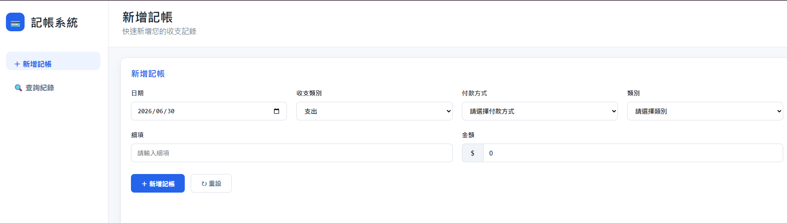
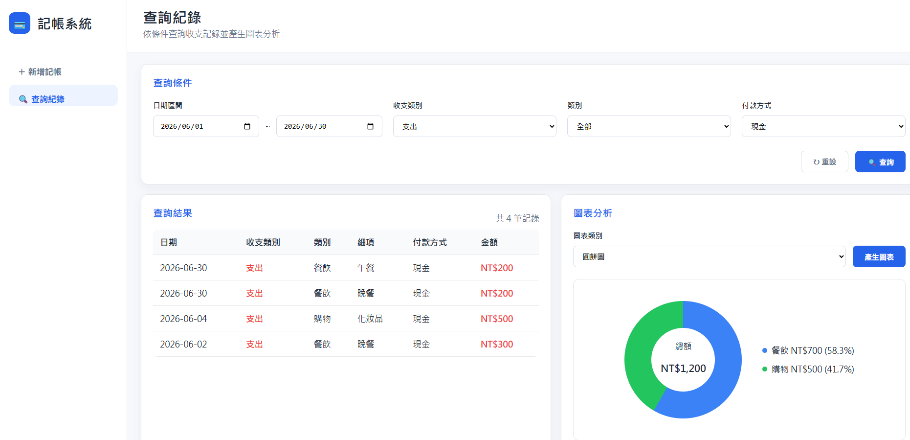
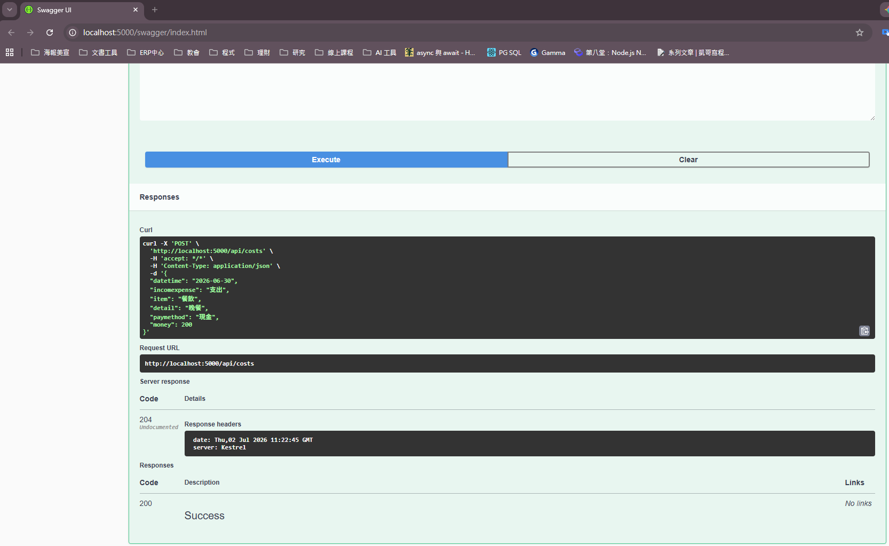
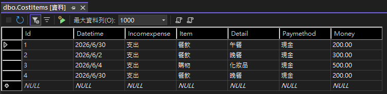

# CostTracker

## 專案背景
將原本用 C# WinForms 撰寫、以 CSV 檔案儲存資料的桌面記帳程式，重構為前後端分離的 Web 應用程式，並逐步將資料儲存從檔案系統遷移至關聯式資料庫。

## 技術棧
**前端**：Angular（Standalone Components）、TypeScript
**後端**：ASP.NET Core Web API（.NET 8）
**資料庫**：SQL Server
**版本控制**：Git / GitHub

## 專案架構
### 前端（Angular）

| 檔案 / 資料夾 | 說明 |
|---|---|
| `frontend/src/app/app.ts` | 主要元件，管理畫面狀態 |
| `frontend/src/app/services/cost.service.ts` | 負責與後端 API 溝通 |
| `frontend/src/app/models/cost-item.ts` | 記帳資料的型別定義 |
| `frontend/src/app/models/chart-data.ts` | 圖表資料的型別定義 |

### 後端（ASP.NET Core Web API）

| 檔案 / 資料夾 | 說明 |
|---|---|
| `backend/CostApi/Controllers/CostsController.cs` | 負責與前端溝通，定義 REST API 路由 |
| `backend/CostApi/Services/CostService.cs` | 業務邏輯層 |
| `backend/CostApi/Services/ICostService.cs` | 業務邏輯層的介面 |
| `backend/CostApi/Models/CostItem.cs` | 記帳資料的資料模型 |

            
## 專案畫面範例
### Add Expense

### Search

### REST API

### Database

